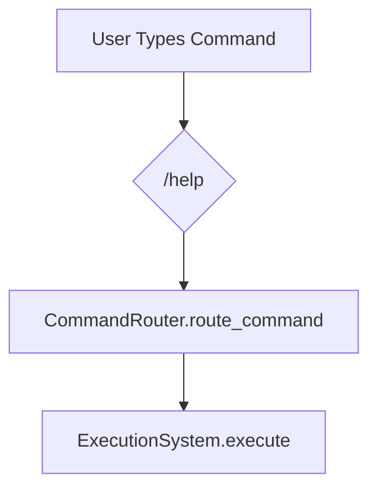
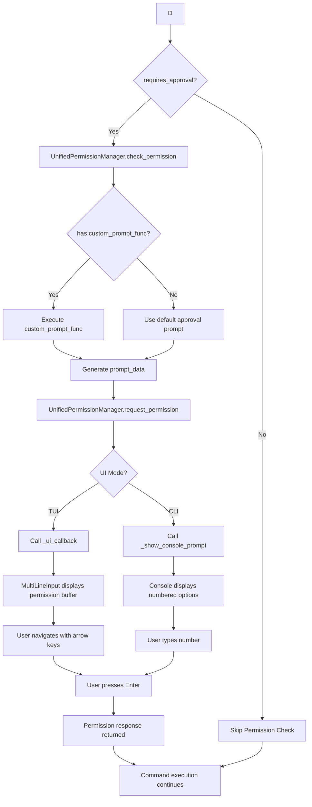
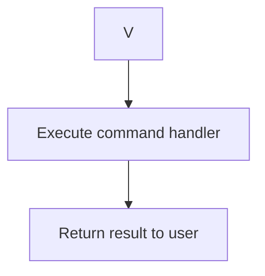

# Consolidated Permission System - Visual Flow Documentation

## 🎯 Overview
Visual documentation of the **consolidated permission system** that unifies 4 separate systems into 1 streamlined flow.

## 🏗️ System Architecture

```
┌─────────────────┐    ┌─────────────────┐    ┌─────────────────┐
│   CLI Mode      │    │   TUI Mode      │    │  Permission     │
│                 │    │                 │    │  Buffer         │
│ • Console Input │    │ • Arrow Keys    │    │  Display        │
│ • Numbered      │    │ • Enter Key     │    │                 │
│   Options       │    │ • Visual UI     │    │ • MultiLineInput │
└─────────────────┘    └─────────────────┘    └─────────────────┘
         │                       │                       │
         └───────────────────────┼───────────────────────┘
                                 │
                    ┌─────────────────────┐
                    │                     │
                    │ UnifiedPermission   │
                    │ Manager             │
                    │                     │
                    │ • check_permission()│
                    │ • request_permission│
                    │ • CLI/TUI auto-detect│
                    └─────────────────────┘
                                 │
                    ┌─────────────────────┐
                    │                     │
                    │ ExecutionSystem     │
                    │                     │
                    │ • execute()         │
                    │ • Single permission │
                    │   check for ALL     │
                    └─────────────────────┘
```

## 🔄 Complete Execution Flow

### Phase 1: Command Input


### Phase 2: Permission Check (CONSOLIDATED)


### Phase 3: Command Execution


## 🎮 UI Interaction Flows

### TUI Mode (Permission Buffer)
```
┌─────────────────────────────────────────────────────────────┐
│ Permission Required: Help System                           │
│                                                             │
│ Choose a help option:                                       │
│                                                             │
│   ▸ Show all commands          ← Cursor position           │
│     Show system info                                       │
│     Cancel                                                  │
│                                                             │
│ [↑/↓ arrows to navigate • Enter to select • Ctrl+C to cancel] │
└─────────────────────────────────────────────────────────────┘

Navigation Flow:
User presses ↓ → MultiLineInput.on_key → permission_selected_option++ → refresh()
User presses ↑ → MultiLineInput.on_key → permission_selected_option-- → refresh()
User presses Enter → Submit selection → UnifiedPermissionManager.handle_response()
```

### CLI Mode (Console)
```
=== Help System ===

Choose a help option:

  1. Show all commands
  2. Show system info
  3. Cancel

Enter choice (number):

User Input Flow:
User types "1" → input() reads → _show_console_prompt processes → returns response
```

## 🔍 Detailed Function Call Sequence

### TUI Mode Flow
```
1. ExecutionSystem.execute()
   ↓
2. UnifiedPermissionManager.check_permission()
   ├── Detects custom_prompt_func in registration.metadata
   ├── Calls custom_prompt_func(app, session, registration, context)
   ├── Receives prompt_data with options array
   └── Calls request_permission(app, session, prompt_data, timeout)
       ↓
3. request_permission() detects TUI mode (app.query_one exists)
   ├── Calls self._ui_callback(prompt_data)
   └── _ui_callback points to TUI._show_permission_prompt()
       ↓
4. TUI._show_permission_prompt()
   ├── Gets MultiLineInput widget: prompt_input = self.query_one("#prompt-input")
   ├── Sets prompt_input.permission_prompt_data = prompt_data
   ├── Calls prompt_input.focus() for keyboard input
   └── Refreshes display
       ↓
5. MultiLineInput displays permission buffer
   ├── watch_permission_prompt_data() triggered
   ├── permission_selected_option set to 0
   └── Visual refresh shows options with cursor
       ↓
6. User Navigation
   ├── Arrow keys → MultiLineInput.on_key()
   ├── Updates permission_selected_option
   ├── Refreshes display (cursor moves)
   └── Enter key submits selection
       ↓
7. Permission Response
   ├── MultiLineInput.action_submit() or action_cancel()
   ├── Posts PermissionResponse message
   ├── UnifiedPermissionManager.handle_permission_response()
   ├── Resolves asyncio.Future in request_permission()
   └── Returns to ExecutionSystem.execute()
       ↓
8. Command Execution Continues
   └── Calls actual command handler (show_help)
```

### CLI Mode Flow
```
1. ExecutionSystem.execute()
   ↓
2. UnifiedPermissionManager.check_permission()
   ├── Same detection logic as TUI
   └── Calls request_permission()
       ↓
3. request_permission() detects CLI mode (no app.query_one)
   ├── Calls _show_console_prompt(prompt_data)
   └── _show_console_prompt() displays options
       ↓
4. Console Interaction
   ├── Prints "=== Title ==="
   ├── Prints message
   ├── Prints numbered options
   ├── Calls input("Enter choice (number): ")
   └── User types number
       ↓
5. Input Processing
   ├── Validates input is digit in range
   ├── Gets selected_option from options array
   ├── Calls handle_permission_response(response, data)
   └── Returns result
       ↓
6. Command Execution
   └── Same as TUI mode
```

## 📊 Data Flow Diagrams

### Permission Data Structure
```json
{
  "title": "Help System",
  "message": "Choose a help option:",
  "options": [
    {
      "text": "Show all commands",
      "response": "allow_once",
      "data": {"help_type": "all"}
    },
    {
      "text": "Show system info",
      "response": "allow_once",
      "data": {"help_type": "system"}
    },
    {
      "text": "Cancel",
      "response": "cancel",
      "data": {}
    }
  ]
}
```

### Context Data Flow
```
Command Execution Context:
{
  "_command_selection": {
    "response": "allow_once",
    "data": {"help_type": "all"}
  }
}

Available to command handler for conditional logic
```

## 🎨 Visual State Transitions

### MultiLineInput States
```
State 1: Normal Input
┌─────────────────────────────────────────────────────────────┐
│ > user input here...                                        │
│                                                             │
│                                                             │
└─────────────────────────────────────────────────────────────┘

State 2: Permission Buffer Active
┌─────────────────────────────────────────────────────────────┐
│ Permission Required: Help System                           │
│                                                             │
│ Choose a help option:                                       │
│                                                             │
│   ▸ Show all commands                                       │
│     Show system info                                        │
│     Cancel                                                  │
│                                                             │
└─────────────────────────────────────────────────────────────┘

State 3: Selection Changed (User pressed ↓)
┌─────────────────────────────────────────────────────────────┐
│ Permission Required: Help System                           │
│                                                             │
│ Choose a help option:                                       │
│                                                             │
│     Show all commands                                       │
│   ▸ Show system info                                        │
│     Cancel                                                  │
└─────────────────────────────────────────────────────────────┘
```

## 🔧 Component Interaction Matrix

| Component | TUI Mode | CLI Mode | Notes |
|-----------|----------|----------|-------|
| ExecutionSystem | ✅ Calls UnifiedPermissionManager | ✅ Same call | Single interface |
| UnifiedPermissionManager | ✅ TUI callback → MultiLineInput | ✅ Console prompt | Auto-detects mode |
| MultiLineInput | ✅ Displays buffer, handles navigation | ❌ Not used | Permission buffer widget |
| TUI Core | ✅ Sets UI callback, manages focus | ❌ Not used | Orchestrates UI flow |
| Console | ❌ Not used | ✅ Direct input/output | Fallback for non-GUI |

## 🐛 Debug Output Flow

### Key Debug Messages to Look For
```
[TUI._show_permission_prompt] Setting permission_prompt_data
[MultiLineInput] PERMISSION ACTIVE - selected_option=0
[MultiLineInput] Calling self.focus()
[UnifiedPermissionManager.check_permission] ENTERED for /help
[UPM] custom_prompt_func returned prompt_data
[UnifiedPermissionManager.request_permission] Got response: {...}
```

### Debug Flow in TUI Mode
```
1. User types /help
2. [UnifiedPermissionManager.check_permission] ENTERED for /help
3. [UPM] custom_prompt_func returned prompt_data
4. [TUI._show_permission_prompt] Setting permission_prompt_data
5. [MultiLineInput] PERMISSION ACTIVE - selected_option=0
6. [MultiLineInput] Calling self.focus()
7. Permission buffer appears with ▸ cursor
8. User presses arrow keys → [MultiLineInput.on_key] KEY=down
9. Cursor moves → permission_selected_option changes
10. User presses Enter → Permission response sent
11. [UnifiedPermissionManager.request_permission] Got response
12. Command execution continues
```

## 🎯 Success Validation Checklist

### TUI Mode ✅
- [ ] Permission buffer appears when typing `/help`
- [ ] ▸ cursor shows current selection
- [ ] ↑/↓ arrows move cursor between options
- [ ] Enter key selects highlighted option
- [ ] Ctrl+C cancels operation
- [ ] Command executes after selection

### CLI Mode ✅
- [ ] Console shows numbered options when using `--fallback`
- [ ] User can type number to select
- [ ] Enter processes selection
- [ ] Command executes after selection

### System Integration ✅
- [ ] All commands with `custom_prompt_func` work
- [ ] Basic approval commands still work
- [ ] No duplicate permission checks
- [ ] Single code path for all permission handling

## 🚀 Performance Characteristics

### Before Consolidation
- ❌ Multiple system instantiations
- ❌ Complex routing logic
- ❌ Duplicate permission checks
- ❌ Separate TUI/CLI code paths

### After Consolidation
- ✅ Single UnifiedPermissionManager instance
- ✅ One permission check per command
- ✅ Unified async flow for both modes
- ✅ Clean separation of UI logic

## 🎉 Key Benefits Achieved

1. **Simplified Architecture**: 4 systems → 1 system
2. **Unified Interface**: Single `check_permission()` method
3. **Automatic Mode Detection**: CLI/TUI handled transparently
4. **Consistent UX**: Same permission flow across all commands
5. **Better Maintainability**: Single codebase for permission logic
6. **Enhanced Debugging**: Clear function call tracing

The consolidated system provides a **clean, efficient, and maintainable** permission architecture that works seamlessly across both CLI and TUI modes! 🎊
